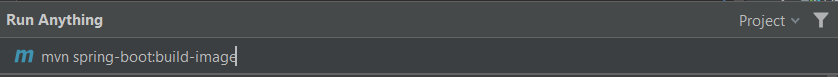
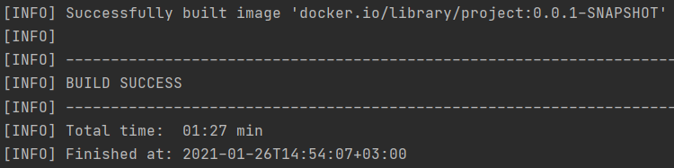
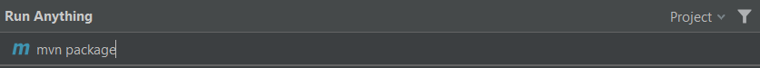
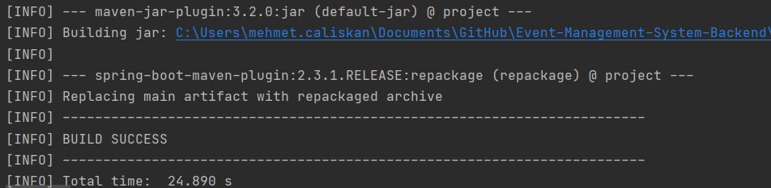

# Maven uygulaması container içine nasıl koyulur?

**Uyarı:** Bunlar yapılmadan önce Docker cihazınızda kurulu olmalıdır.

### Uygulama Spring Boot uygulaması ise

`mvn spring-boot:build-image` komutu çalıştırılır ve Docker imajı oluşturulur.





### Uygulama Spring Boot uygulaması değilse

1. Öncelikle `mvn package` komutu kullanılarak uygulama jar haline getirilir.


  
2. *BUILD SUCCESS* mesajı görüldükten sonra proje klasöründe *Dockerfile* dosyası oluşturulur. Bu dosyanın içeriği en temel şekilde şöyle olabilir:
  
```
FROM openjdk:14-jdk-alpine
ARG JAR_FILE=target/*.jar
COPY ${JAR_FILE} app.jar
ENTRYPOINT ["java","-jar","/app.jar"]
```



3. `docker build -t project/project-docker .` komutu çalıştırılır ve Docker imajı oluşturulur.
  

  
